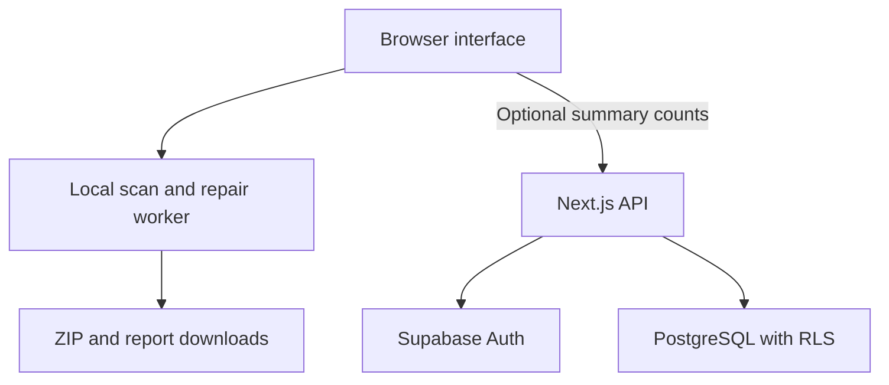

**Export Repair and Migration Checker — Initial Implementation Plan**

Version: 1.0 · Prepared: 24 September 2026 · Status: proposed implementation plan, not an implemented or tested application.

This document puts the complete user interface first. It then explains the processing engine, backend, database, testing, and build order. It uses a small first release so one developer can make steady progress.

**Project goal**

Help a user check a Notion Markdown/CSV export, understand broken references, approve supported link repairs, and download a checked or repaired copy. The original ZIP must remain unchanged.

The first output target is a portable Markdown folder inside a ZIP. Users can later open or import the files into another application themselves. The website does not connect to Notion, log into a destination app, or recreate a complete Notion workspace.

**The main product decision:** process the archive on the user's device. Use the backend and database for optional sign-in and saved summary counts. This provides a real backend without requiring users to upload their notes.

**What belongs in the initial release**

| Include | Exact first-release boundary |
| --- | --- |
| Notion Markdown/CSV ZIP selection | One ZIP per session; validate the archive rather than trusting its extension. |
| Inventory | Count and list files, Markdown notes, images, and other attachments. |
| Link checks | Supported Markdown links, image references, and reference-style definitions. |
| Suggested repairs | Show existing candidate files; require approval before changing a destination. |
| Filename and path warnings | Report problems. Automatic filename and folder renaming is a later feature. |
| Preview | Escaped text and before/after link changes; small supported raster-image previews. |
| Download | New ZIP, local HTML/JSON report, inventory, and change log. |
| Optional account | Email code sign-in and a history of summary counts. |
| Public information | Home, guides, help, privacy, and terms pages. |

Automatic renaming is deliberately postponed: a Notion export can contain CSV and HTML references too. Changing filenames before those references are fully supported could break content that currently works. This plan still includes filename diagnosis and a clear later milestone for safe renaming.

**Document order:** A. UI and user experience → B. architecture and repair engine → C. backend and database → D. testing and implementation milestones.

---

**A. Build the user interface first**

**A1. Visual style**

Use a clean document-workspace style. The product should feel calm, trustworthy, and easy to understand. Show a real sample report instead of a decorative AI illustration.

| Design item | Specification |
| --- | --- |
| Main background | `#F8FAFC` |
| Cards and panels | `#FFFFFF` |
| Main text | `#0F172A` |
| Secondary text | `#475569` |
| Main action | Indigo `#4F46E5`, white button text |
| Positive result | Dark teal text `#0F766E` with a pale teal background |
| Warning | Dark amber text `#92400E` with a pale amber background |
| Error | Dark red text `#B91C1C` with a pale red background |
| Borders | `#CBD5E1` |
| Typography | System sans-serif; self-host an optional font later. Monospace for paths and code. |
| Text sizes | Body 16px; helper text at least 14px; page titles about 28–36px. |
| Spacing | Use a consistent 4px spacing scale. Main gaps: 16, 24, and 32px. |
| Corners | About 12px for panels and 8px for controls. |
| Icons | Lucide icons, always accompanied by a label for important actions. |
| Animation | Short progress and panel transitions; respect reduced-motion settings. |
| Layout width | About 1120px for public pages; a wider workspace up to about 1440px. |

Check actual foreground/background contrast during UI review. Status must be communicated with text and icons as well as color.

Use these user-facing phrases consistently:

- Main promise: **“Check your export. Review the fixes. Download a cleaner copy.”**
- File action: **“Choose ZIP file”**, not “Upload” when the file stays on the device.
- Privacy note: **“Your archive is processed on this device.”**
- Account note: **“Save summary counts to your account. Your files are not saved.”**
- Limit note: **“We can flag missing files, but cannot recreate them.”**

These statements may appear in the released site only when the implementation and network checks support them. Prototype screens must carry a visible “Demo data” label.

**A2. Page and route map**

| Route | Access | Purpose | Initial release |
| --- | --- | --- | --- |
| `/` | Public | Explain the tool and show a sample result. | Yes |
| `/check` | Public | Select, scan, review, repair, and download. | Yes |
| `/login` | Public | Email code sign-in, using the same component as the workspace dialog. | Yes |
| `/dashboard` | Signed in | List saved summary records. | Yes |
| `/dashboard/reports/[id]` | Owner only | Show one saved summary and its limitations. | Yes |
| `/account` | Signed in | View account email, sign out, and delete account. | Yes |
| `/guides` | Public | List a small set of original guides. | Yes |
| `/guides/notion-export` | Public | Explain the supported export format. | Yes |
| `/guides/understanding-results` | Public | Explain warnings and supported repairs. | Yes |
| `/help` | Public | Troubleshooting, supported formats, and limits. | Yes |
| `/privacy` | Public | Explain local processing and optional account data. | Yes |
| `/terms` | Public | Explain the service and its limitations. | Yes |
| Not-found and unexpected-error screens | Public | Give a useful way to recover. | Yes |

There is no pricing, checkout, administrator dashboard, or cloud file library in the first release. Add their UI when their supporting product features are ready.

**A3. Shared navigation and footer**

Public header: product name/logo, “Check an export,” “Guides,” and “Help.” Show “Sign in” for a guest and “My reports” for an authenticated user.

The workspace header should remain compact. Include the product name, local-processing indicator, help link, and account menu. Navigation away from an active session should warn that the selected archive will need to be chosen again.

Footer: brief product description, guides, help, privacy, terms, and a statement that this is an independent tool. Do not imply an official Notion or Obsidian partnership.

On mobile, use a labelled menu button with a keyboard-accessible sheet. Every navigation item must lead to a working page.

**A4. Home page — `/`**

Build these sections in this order:

| Section | Content and behavior |
| --- | --- |
| Hero | Main promise, one-sentence explanation, “Check my export” and “Try a sample” buttons. |
| Scope strip | “Notion Markdown/CSV ZIP” · “Works without an account” · “Original stays unchanged.” |
| Sample report | Clearly labelled synthetic example showing issue, suggested target, and review action. |
| How it works | Choose file, review findings, approve repairs, download a copy. |
| What it checks | Markdown links, missing local image references, unsupported content, and long paths. |
| What results mean | Explain “Can review a fix,” “Needs manual attention,” and “Not checked.” |
| Privacy explanation | Archive stays local; saving a summary is optional and sends only the stated counts. |
| FAQ | Supported formats, missing files, refresh behavior, and why some issues cannot be repaired. |
| Final action | “Check my export.” |

“Try a sample” opens `/check` with an intentionally broken synthetic export. Users should be able to complete the same workflow they would use with their own file.

Do not add invented customer logos, testimonials, download counts, or success percentages.

**A5. Workspace — `/check`**

Keep the workflow on one route so navigating between steps does not discard the selected browser File object. Use a state machine rather than separate unrelated pages.

The visible steps are **Choose file → Scan → Review → Build copy → Download**. Allow backward movement where it is safe. Editing repair selections after building a copy invalidates the old output and requires a rebuild.

**Step 1: Choose file**

Components:

- Page title: “Check your Notion export.”
- Short explanation and link to the export guide.
- Accessible drop zone and standard file chooser.
- Supported source label: “Notion — Markdown & CSV.”
- Output label: “Portable Markdown ZIP.”
- Chosen file card with filename, size, and “Remove” action. These details stay local.
- Limits message and privacy note.
- Main button: “Start check.”
- Secondary button: “Try a sample.”

Initial states: no selection, drag-over, selected, invalid ZIP, unsupported export, over limit, and validation failure.

The Start button is disabled until the initial ZIP check passes. Selecting another file clears the previous findings, approvals, and downloads after confirmation. Do not add nonfunctional format selectors for future platforms.

**Step 2: Scan**

Show real processing stages: checking the archive, reading notes, checking references, and preparing findings. When counts are known, show “34 of 120 notes checked.” Before counts are available, use an indeterminate indicator.

Include a Cancel button. Cancel terminates the current worker task and prevents stale messages from updating the interface. Offer “Choose another file” or “Check again.” Do not display fake progress that always succeeds after a timer.

**Step 3: Review**

Desktop layout:

| Area | Contents |
| --- | --- |
| Top summary | File count, checked Markdown links, total findings, and available repair suggestions. |
| Coverage banner | State what was checked and what was skipped. A clean result must not hide unsupported content. |
| Left panel | Searchable file tree and filters for notes, images, and other files. |
| Main panel | Tabs: Issues, Files, and Repair plan. |
| Right drawer | Selected issue details, escaped text context, and before/after destination. |
| Bottom action area | Selected change count, “Download report,” “Save scan summary,” and “Review selected changes.” |

Issue table columns: checkbox where eligible, category, source file, short explanation, suggested action, and status. Provide severity/category filters and a clear reset action. Search filenames locally; do not put searches or paths in the URL.

Use pagination or list virtualization for large results. Long paths should wrap or be expandable and copyable without breaking the layout.

**Issue categories and actions**

| Finding | Example explanation | User action |
| --- | --- | --- |
| Broken local note link | “The referenced note is not at this location.” | Review candidate or choose an existing file. |
| Missing local image reference | “This image path does not exist in the archive.” | Choose a matching image if present; otherwise leave unresolved. |
| Case mismatch | “The filename uses different letter casing.” | Review a unique candidate. |
| Ambiguous target | “More than one file may match this reference.” | Pick a target manually or skip. |
| Long path | “This path may cause problems when extracting on some systems.” | Read explanation; no automatic rename in version 1. |
| Unchecked content | “Links inside this CSV or HTML content were not checked.” | Open local file details and view the limitation. |
| Unsupported Markdown syntax | “This link could not be mapped to a safe edit range.” | Leave unchanged and report. |

Suggested changes are unchecked by default. A “Select all eligible suggestions” action may select only non-ambiguous suggestions and must still lead to a review step. Never select a fuzzy match automatically. Saving here creates a `scan_only` summary; building a copy later creates a new finalized result ID, rather than rewriting the saved scan record.

**Issue details drawer**

Show the original link text, source filename, source line if available, original destination, proposed destination, reason for the suggestion, and remaining limitation. Clearly distinguish “unique existing candidate” from “chosen manually.” Avoid invented confidence percentages.

Show a small text excerpt around the issue. Escape all content. Code and HTML from the archive must appear as text, not execute in the page. Preview only supported raster images within a small size limit; treat SVG, HTML, PDF, and scripts as files rather than active previews.

Buttons: “Approve change,” “Choose another target,” “Skip,” “Copy path,” and close. If the source uses a shared reference definition, explain that changing it affects every use of that definition in the note.

**Repair plan tab**

List each selected edit with its source location and original/new destination. Provide Remove and Clear selection. A manual target chooser searches only entries present in the archive.

The confirmation dialog should say, for example: “Create a new copy with 3 approved link changes? Your original ZIP will stay unchanged.” Counts in live screens must come from the current plan.

**Step 4: Build copy**

Apply approved changes, recheck the modified files, copy all other files, and build the new ZIP. Show actual stages and a Cancel button.

If an edit no longer matches its source or validation finds a newly broken supported link, stop and explain the affected change. Return to Review with the user's selections preserved. A failed validation must not produce a green success screen.

**Step 5: Download**

Display the outcome using accurate wording:

- “Repaired copy ready” when approved changes were applied and rechecked.
- “Checked copy ready” when no content changes were applied.
- “Some issues still need attention” when unresolved findings remain.

Show before/after issue counts, applied change count, and a separate list of unchecked areas. Do not show “100% migration ready.”

Buttons: “Download ZIP,” “Download report,” “Download change log,” “Save summary,” and “Check another export.” Download report offers HTML or JSON. Browser print-to-PDF can be added later; it is not required initially.

“Download ZIP” starts a browser download. A click does not prove the operating system saved the file; label the feedback “Download started.” Allow another download until the user clears the session.

**A6. Sign-in UI — page and dialog**

Use passwordless email codes. The UI has email entry, sending, code entry, verifying, success, invalid/expired code, and resend states. Use the provider's actual rate limits and error responses.

In `/check`, open sign-in in a dialog so successful login does not refresh the page or lose the archive. Reuse the same component on `/login`. Sign-in must never be required to scan or download.

For a guest clicking Save summary, show exactly what will be saved: date, engine version, file/link counts, finding counts, and result type. After sign-in, keep the archive in memory and ask the user to confirm saving that summary. Do not silently save old scans.

Configure the authentication email template to send the code used by this UI. Verify the template and production email delivery as part of the backend milestone.

**A7. Dashboard — `/dashboard`**

The dashboard stores a history of summaries, not a library of ZIP files.

Provide a page title, “Check another export” button, result-type filter, newest-first list, pagination, and an empty state: “No summaries saved yet.” Each row uses a generated title such as “Report — 24 September 2026,” the server save date, file count, issue count, changes applied, and View/Delete actions.

Do not display private archive filenames in saved rows. Do not show Resume repair or Re-download ZIP: the server does not have those files.

Dashboard states: loading, empty, loaded, expired sign-in, server unavailable, deletion pending, and deletion failed. An API problem must not affect a completed local repair session.

**A8. Saved summary — `/dashboard/reports/[id]`**

Show the recorded counts and this clear note: “This record contains summary counts only. To inspect files or run another repair, choose the original archive again.”

Include Back to reports, Check an export, and Delete summary. Return a generic not-found screen for an invalid ID or a record belonging to another user.

Counts are reported by the browser. Avoid presenting them as an independently certified audit.

**A9. Account — `/account`**

Show the authenticated email, an optional display-name field with Save profile, what is stored, Sign out, and Delete account. The email is managed by the authentication provider; do not build an email-change flow in the first release. State that the display name is account information saved separately from scan summaries.

Delete account opens a confirmation dialog requiring the user to type `DELETE`. Explain that saved summaries will be deleted. Keep the user informed if deletion fails; do not show success until the backend confirms completion.

**A10. Guides, help, privacy, and terms**

Guides should use small synthetic examples and link to official export documentation. State the supported format and the parts of Notion that a portable archive does not recreate.

Help must cover unsupported ZIPs, password-protected archives, nested exports, resource limits, missing files, no repair candidates, refresh/session loss, and browser download problems.

Privacy must describe selected file handling, in-memory lifetime, optional account metadata, hosting logs, and any analytics actually enabled. Do not claim the whole website makes no network requests; page loading and optional account features do use the network.

Terms should describe the service's real limits and user responsibilities. Treat the text as a draft for review before public launch. Avoid claiming guaranteed recovery or complete compatibility with another app.

**A11. Responsive behavior and accessibility**

| Width | Behavior |
| --- | --- |
| About 1280px and above | File tree, main results, and issue drawer can appear together. |
| About 768–1279px | Collapse the file tree; issue details open in a sheet. |
| About 320–767px | Single-column layout; compact steps; issue cards replace the wide table. |

Support keyboard operation for file selection, issue review, checkboxes, target selection, dialogs, and downloads. Manage dialog focus and return it to the trigger. Announce processing changes with appropriate live-region text. Associate errors with form fields. Use practical touch targets of about 44px and test zoom at 200%.

Desktop browsers are the initial performance reference. Test small archives on mobile; a mobile layout alone does not establish that large files will process reliably.

**A12. Reusable components and UI mock data**

| Component group | Suggested components |
| --- | --- |
| Layout | `PublicHeader`, `WorkspaceHeader`, `Footer`, `PageContainer` |
| File selection | `ZipDropzone`, `SelectedFileCard`, `LimitsNotice`, `SamplePicker` |
| Workflow | `StepIndicator`, `ScanProgress`, `CoverageBanner`, `ResultSummary` |
| Results | `FileTree`, `IssueFilters`, `IssueTable`, `IssueCard`, `IssueDrawer` |
| Repairs | `TargetPicker`, `DestinationDiff`, `RepairPlanList`, `ConfirmRepairDialog` |
| Downloads | `DownloadPanel`, `SaveSummaryDialog`, `ClearSessionDialog` |
| Account | `EmailCodeForm`, `SummaryHistory`, `DeleteSummaryDialog`, `DeleteAccountDialog` |
| Shared states | `EmptyState`, `InlineError`, `LoadingState`, `Toast`, `NotFoundState` |

Create synthetic UI scenarios for an empty workspace, healthy archive, repairable link, missing image, ambiguous target, long path, partial coverage, rejected ZIP, cancelled scan, failed rebuild, and saved-summary API failure.

The UI prototype may simulate these states, but all simulated data must be labelled. The production build must switch to the real worker adapter and never silently fall back to fake results after an error.

**UI milestone acceptance:** all listed pages exist; each control has a defined action; every main state can be demonstrated; mobile layouts are usable; and no working scan is claimed before the engine is connected.

---

**B. Architecture and processing engine**

**B1. Recommended stack**

| Layer | Choice | Reason |
| --- | --- | --- |
| Application | Next.js App Router with TypeScript | One project for public pages, interactive UI, and backend routes. |
| Styling | Tailwind CSS and a small set of shadcn/ui components | Consistent controls without designing every primitive. |
| Icons | Lucide React | A coherent icon set. |
| Form/data validation | Zod | Validate public API requests and worker message shapes. |
| Local state | React reducer/context for the workspace state machine | Explicit transitions; no need for a large state library initially. |
| ZIP processing | `@zip.js/zip.js` behind an adapter | ZIP reading/writing with checksum checks and streaming-oriented APIs. |
| Markdown parsing | `unified`, `remark-parse`, `remark-gfm` | Identify actual Markdown links rather than matching the whole file with regex. |
| Heavy work | Browser Web Worker | Keep file processing away from the main UI thread. |
| Authentication/database | Supabase Auth and PostgreSQL | Managed sign-in and database access with row-level security. |
| Tests | Vitest for engine rules; Playwright for meaningful browser flows | Protect file correctness and the critical end-to-end journey. |

Use currently supported stable package releases at implementation time. Record exact installed versions in the lockfile. This plan does not require a particular major version or claim compatibility has already been tested.

Next.js documents the server/client split and Route Handlers [S2–S3]. Browser workers provide a separate processing thread [S4]. ZIP checksum options and Markdown parser behavior should be verified against the installed versions [S6–S8].

**B2. Data flow**



The archive, note text, image data, private paths, file hashes, and detailed findings remain inside the browser. They do not cross the API connection in this architecture. The user can intentionally download local reports containing those details.

The local tool must continue to work when the user is signed out or the metadata backend is unavailable. Do not advertise full offline website support; a first visit still needs the application assets.

**B3. Proposed project structure**

| Location | Responsibility |
| --- | --- |
| `src/app/(public)/` | Home, guides, help, privacy, terms. |
| `src/app/check/page.tsx` | Workspace entry. |
| `src/app/(account)/` | Login, dashboard, account screens. |
| `src/app/api/` | Authenticated metadata endpoints. |
| `src/components/` | Shared UI components. |
| `src/features/workspace/` | Reducer, state types, worker client, workspace composition. |
| `src/features/history/` | Saved summary views and API client. |
| `src/lib/engine/` | Archive adapter, indexing, parsing, resolution, repair planning, validation. |
| `src/lib/engine/reporting/` | Escaped HTML report, JSON report, inventory, change log. |
| `src/workers/export.worker.ts` | Local worker entry. |
| `src/lib/supabase/` | Browser and server authentication clients. |
| `src/lib/validation/` | Strict schemas for requests and messages. |
| `src/content/guides/` | Maintained Markdown/MDX guide content. |
| `supabase/migrations/` | Database schema and RLS policies. |
| `tests/fixtures/` | Synthetic ZIPs and expected findings. |
| `tests/engine/` and `tests/e2e/` | Core correctness and browser tests. |
| `public/samples/` | Clearly identified example exports. |

Import browser-only file APIs only from client/worker code. Do not send File objects, note content, or output Blobs to Server Actions.

**B4. Workspace state model**

| State | Allowed next steps |
| --- | --- |
| `idle` | Select file or load sample. |
| `validating` | Begin scan, reject, or cancel. |
| `scanning` | Review findings, fail, or cancel. |
| `reviewing` | Edit selections, download report, build output, or clear. |
| `building` | Validate output, fail, or cancel. |
| `verifying` | Complete, return to review with a failure, or cancel. |
| `complete` | Download, save optional summary, edit selections, or clear. |
| `cancelled` | Retry from the original input or choose another file. |
| `failed` | Show a specific error and an appropriate retry/reset action. |

Give every worker run a unique `runId`. Ignore events from a previous run after cancellation or input replacement. Give every finalized result its own `clientResultId` for saving metadata once.

Do not put files or detailed findings in localStorage, sessionStorage, IndexedDB, analytics, URLs, or service-worker caches in version 1. Keep them in session memory. Revoke object URLs and release references when the user clears the session. A before-unload warning is useful, but browser behavior varies, so explain that refresh requires selecting the file again.

**B5. Initial resource limits**

These are proposed application limits to benchmark, not library or Notion guarantees.

| Resource | Starting limit |
| --- | --- |
| Selected ZIP | 50 MiB compressed |
| Expanded archive total | 150 MiB, checked during decompression as well as before it |
| File/directory entries | 2,500 |
| Text parsed from one Markdown file | 2 MiB |
| Total parsed Markdown text | 25 MiB |
| Reference count | 100,000; stop with a clear limit result if exceeded |
| Compression ratio | Reject an entry exceeding 100:1; document that valid highly compressible archives may also hit this limit |
| Image preview | Raster formats only, up to 5 MiB per preview |
| Worker concurrency | Start with one archive task and bounded entry processing |
| Generated report files | 25 MiB total; bound excerpts and stop clearly if a complete report would exceed this budget |
| Output read-back budget | 175 MiB expanded and 2,505 entries, allowing five generated files in addition to the input budget |

Reject encrypted ZIPs, multi-volume ZIPs, malformed directory records, ambiguous duplicate entry names, and archive members that escape the archive root. For the portable first release, reject member-path collisions under exact comparison or case-folded NFC comparison; explain that the names would be ambiguous on some destination systems. Keep original names when no collision exists. Do not recursively unpack nested archives. Report a nested archive as an unsupported export and ask for a direct supported export.

Oversized text files that fit the archive budget may be preserved as opaque files, but mark their references as unchecked. A checksum failure or exceeded archive budget stops the operation. Use actual streamed byte counts and cancellation; do not trust the ZIP's declared sizes alone. OWASP identifies archive expansion as a real resource risk [S12].

For path warnings, start with conservative heuristics: a relative path longer than 200 Unicode code points or a single component longer than 120. Label these as portability warnings, not operating-system limits. The user's extraction folder also affects the final path length. Do not confuse these warnings with unsafe paths that must be rejected.

**B6. Internal data objects**

Keep these objects local. The backend summary schema is separate and much smaller.

| Object | Important fields |
| --- | --- |
| Archive entry | Stable local ID, original path, file kind, compressed/expanded size, read capability, checksum status. |
| Markdown document | Entry ID, original text/bytes, BOM/newline information, parser findings. |
| Reference | Source entry ID, destination span, original destination, label, kind, local/remote classification. |
| Issue | Local ID, category, severity, explanation, reference ID, candidate IDs, review status. |
| Approved change | Source entry ID, old destination, new destination, exact source span, approval reason, source fingerprint. |
| Coverage | Checked file/reference counts, skipped categories, unsupported syntax, engine version. |
| Final result | New Blob, before/after counts, change log, local reports, result ID. |

**B7. Scan algorithm**

1. Validate the ZIP structure and resource limits. Enumerate entries without recursively extracting archives.
2. Build a lookup of exact archive paths. Keep original filenames unchanged.
3. Identify supported UTF-8 Markdown documents. Handle a UTF-8 BOM and preserve newline style. Unsupported encodings remain unchanged and receive a coverage warning.
4. Parse Markdown, including common GFM constructs. Find inline links, images, and reference definitions. Ignore code blocks and inline code.
5. Classify each destination. `https:`, `http:`, `mailto:`, and other external schemes are not fetched. Treat potentially executable schemes as unsafe for preview. Fragment-only links are outside the first-release anchor checker.
6. Resolve local paths relative to the source note's directory. Split query/fragment components before decoding the path. Decode percent escapes once, retain literal plus signs, and reject malformed or root-escaping paths.
7. Compare with the exact path lookup. A secondary index may find case-only or unique page-ID candidates, but these are suggestions requiring review.
8. Record missing targets, available candidates, path warnings, and coverage limitations. Do not infer that a missing reference means the original source file was deleted.

Important distinction: ZIP member names containing traversal segments such as `../` must be rejected. A Markdown link such as `../Images/photo.png` can be valid if resolution remains inside the archive root.

Do not globally lowercase or Unicode-normalize stored names. Use comparison keys only to detect ambiguity or portability risks, and preserve exact source names. Do not double-decode `%2520` or treat every percent sign as a space.

External Notion URLs, heading anchors, links in CSV cells, raw HTML attributes, CSS, scripts, and unsupported Markdown extensions are reported as unchecked. The first release does not validate remote website availability.

Notion's official documentation confirms that Markdown/CSV exports have limitations and can include HTML representations of some content [S1]. Surface that limitation rather than implying every reference was examined.

**B8. Candidate selection and repair policy**

Prefer an exact existing target after correct URL/path resolution. If the exact target is missing, show candidates only when there is a defensible explanation, such as a unique case-only difference or a uniquely matched exported page identifier. If several candidates remain, ask the user to choose.

Do not use a language model to guess file contents or silently choose a similar title. A manual choice must still point to a member present in the selected ZIP. Preserve the original query and fragment components; explain that heading-fragment validity was not checked.

A chosen destination must be generated as a relative path from the source note to the target. Encode path segments appropriately without encoding directory separators or treating a filename's `#` as a heading fragment.

**B9. Apply changes without damaging formatting**

Use the Markdown syntax tree to identify valid reference nodes, then locate the exact destination token span with a syntax-aware range locator. Node positions alone do not necessarily identify the destination substring. For shared reference definitions, update the definition once.

Patch approved destination spans from the end of the original string toward the beginning. Check that spans do not overlap and that the original source still matches the recorded value. Do not run a global regex replacement and do not parse then reserialize the entire document merely to change one link. Full serialization can alter unrelated formatting [S8].

Track JavaScript string offsets separately from encoded byte offsets. Preserve BOM and line endings. If a destination's edit range cannot be established safely, mark it unsupported and leave it unchanged.

Version 1 does not rename files, remove UUIDs, merge duplicates, change prose, edit CSV contents, or delete attachments. Its repair output consists of approved link-destination changes plus generated reporting files.

**B10. Verify the output**

Before offering the new ZIP:

1. Reparse modified Markdown documents.
2. Confirm every applied destination resolves to the selected existing member.
3. Confirm no previously resolved supported reference became unresolved.
4. Confirm every input member is still present at its original path.
5. Confirm untouched member bytes are unchanged, using hashes computed locally.
6. Record approved edits and unresolved/unchecked areas separately.
7. Read back generated ZIP entries and verify integrity within the explicitly defined output budget. Count the generated report files too; do not write an extra ZIP directory entry for the report folder.

ZIP compression bytes and container timestamps may differ. The preservation promise applies to the content bytes of unchanged members, not to a byte-identical ZIP container.

Cancellation or validation failure discards the generated output. The user still has their original selected file.

**B11. Download contents**

The output ZIP keeps the original member paths and adds a new uniquely named report directory, such as `export-repair-report-<short-id>/`. If that name already exists, select another name; never overwrite an input member.

| Generated file | Purpose |
| --- | --- |
| `report.html` | Escaped, readable findings and coverage summary. |
| `report.json` | Structured findings, counts, and engine version. |
| `changes.json` | Approved before/after destinations and source locations. |
| `index.html` | A simple local file inventory with safe relative links. |
| `README.txt` | What was checked, what changed, remaining limits, and how to use the copy. |

HTML reports must contain no scripts, remote resources, or executable archive content. Escape filenames and note excerpts. The index is an inventory, not a promise to render every original file type. Opening a Markdown file may show raw text depending on the viewer.

Reports can contain private filenames and excerpts. Explain this near the download controls so the user can decide where to share them. Do not create a public report URL in version 1.

---

**C. Backend, database, and authentication**

**C1. Backend responsibilities**

Use Next.js Route Handlers for the following application features:

- Verify the signed-in user.
- Save a bounded summary of a completed local result after the user requests it.
- List and retrieve the user's saved summaries.
- Delete an owned summary or the user's account.
- Return consistent errors and enforce request validation.

Do not create an archive-upload endpoint, cloud repair queue, or ZIP storage bucket for version 1. Those would change the product's file-handling promise and require a separate design.

Keep authenticated responses private and uncached. Do not use user-supplied `user_id` values to determine ownership. Derive the user from the verified server session using the current Supabase server-auth pattern [S9–S11].

**C2. API contract**

| Method and path | Access | Behavior |
| --- | --- | --- |
| `GET /api/session` | Public | Return signed-in status and the minimum account information needed by the UI. |
| `PATCH /api/profile` | Signed in | Save an optional display name of at most 60 characters for the calling user. |
| `GET /api/reports?cursor=...&limit=20` | Signed in | Return paginated owned summaries; cap limit at 50. |
| `POST /api/reports` | Signed in | Validate and save one finalized result summary. |
| `GET /api/reports/[id]` | Owner | Return one summary, or a generic 404. |
| `DELETE /api/reports/[id]` | Owner | Delete one summary; return 204 on completion. |
| `DELETE /api/me` | Signed in | Verify explicit confirmation and delete the calling account. |

Email code requests and verification use Supabase Auth rather than a custom password database. The UI may call the supported Auth client directly; these calls are separate from the local archive worker.

Example summary request, with illustrative values:

```json
{
  "clientResultId": "73e5c667-6a9a-40bd-8c2b-ab8590e8bf20",
  "engineVersion": "1.0.0",
  "sourceFormat": "notion_markdown_csv",
  "resultKind": "repaired",
  "fileCount": 40,
  "markdownCount": 25,
  "checkedReferenceCount": 80,
  "issueCountBefore": 5,
  "issueCountAfter": 2,
  "appliedChangeCount": 3,
  "uncheckedFileCount": 2
}
```

There is intentionally no archive filename, source path, note excerpt, detailed issue, or file hash in the request.

Use strict schemas that reject unknown properties. Set a small metadata-body limit, such as 8 KiB, and reject multipart/file bodies. All counts must be integers at least zero. Cap file/Markdown/unchecked-file counts at 2,500, checked-reference/applied-change counts at 100,000, and each finding count at 200,000. Check relationships such as `markdownCount <= fileCount` and `uncheckedFileCount <= fileCount`. The server cannot prove browser-reported counts are truthful; do not use these summaries as security certifications or trusted billing usage.

`clientResultId` is unique per finalized result and per user. A repeated identical POST returns the existing record; a repeated ID with different values returns 409. This makes a retry after a lost response safe.

Errors should use a consistent shape:

```json
{
  "error": {
    "code": "AUTH_REQUIRED",
    "message": "Sign in to save a summary."
  }
}
```

Use 400 for invalid data, 401 for missing/invalid authentication, 404 for inaccessible records, 409 for a conflicting retry, 413 for oversized bodies, 429 for limits, and 500 for unexpected failures. Do not expose stack traces or provider secrets.

**C3. Database model**

Use Supabase's existing `auth.users` table for identity. Do not store passwords in application tables.

Two application tables are enough initially:

| Table | Field | Type / purpose |
| --- | --- | --- |
| `profiles` | `id` | UUID primary key referencing `auth.users.id`, delete cascade. |
| `profiles` | `display_name` | Optional short user-provided name. |
| `profiles` | `created_at` | Server timestamp. |
| `scan_summaries` | `id` | Server-generated UUID primary key. |
| `scan_summaries` | `user_id` | Required owner UUID referencing `auth.users.id`, delete cascade. |
| `scan_summaries` | `client_result_id` | Browser-generated UUID for idempotency; unique with owner. |
| `scan_summaries` | `engine_version` | Bounded version string, such as `1.0.0`. |
| `scan_summaries` | `source_format` | Constrained to `notion_markdown_csv` initially. |
| `scan_summaries` | `result_kind` | `scan_only`, `checked_copy`, or `repaired`. |
| `scan_summaries` | `file_count`, `markdown_count` | Nonnegative bounded integers. |
| `scan_summaries` | `checked_reference_count` | Nonnegative bounded integer. |
| `scan_summaries` | `issue_count_before`, `issue_count_after` | Finding counts from the same engine rule set. |
| `scan_summaries` | `applied_change_count` | Number of destination edits; may differ from issues resolved. |
| `scan_summaries` | `unchecked_file_count` | Number of files containing unchecked or unsupported content. |
| `scan_summaries` | `created_at` | Server save time; dashboard sorting uses this time. |

Keep file records, reference records, and detailed issues in local memory. Do not add server tables for them just to make the database look more complete.

Required database constraints: primary/foreign keys, owner/result uniqueness, bounded counts, allowed enum values, a restricted engine-version format, and `markdown_count <= file_count`. Include an index on `(user_id, created_at desc, id)` for pagination.

Do not assume applied changes equal resolved findings. A single reference-definition edit can fix several uses. Store before/after counts independently.

**C4. Access rules and migrations**

Enable row-level security on every exposed application table. Supabase documents how RLS restricts rows to the current authenticated user [S10].

| Table/action | Rule |
| --- | --- |
| Profiles select | User can read their own profile. |
| Profiles insert/update | User can create/update only the row with their own ID. |
| Summaries select | User can read only rows they own. |
| Summaries insert | `user_id` must equal the authenticated user. |
| Summaries delete | User can delete only rows they own. |
| Summaries update | No client update policy; completed summaries are immutable. |
| Anonymous requests | No access to either table. |

Example policy pattern, to include in a reviewed migration after table creation:

```sql
alter table public.scan_summaries enable row level security;

create policy "read_own_summaries"
on public.scan_summaries for select to authenticated
using ((select auth.uid()) = user_id);

create policy "insert_own_summaries"
on public.scan_summaries for insert to authenticated
with check ((select auth.uid()) = user_id);

create policy "delete_own_summaries"
on public.scan_summaries for delete to authenticated
using ((select auth.uid()) = user_id);
```

Define matching table grants and profile policies in the same migrations. Test both the API routes and direct Data API access with two different users. Hiding a row in the frontend is not authorization.

Normal routes should use the user's authenticated Supabase client so RLS remains active. Use an administrative secret only in the server-only account-deletion operation. Verify the calling user first and delete that exact ID; do not accept an arbitrary target ID from the request.

Database row deletion takes effect in the live application when the transaction succeeds. Document the hosting provider's backup retention separately; do not promise instant deletion from all historical backups.

**C5. Configuration and secrets**

| Configuration | Exposure |
| --- | --- |
| `NEXT_PUBLIC_SUPABASE_URL` | Public application configuration. |
| `NEXT_PUBLIC_SUPABASE_PUBLISHABLE_KEY` | Public key; permissions still depend on RLS. |
| `SUPABASE_SERVICE_ROLE_KEY` | Server-only secret if required by the chosen admin client for account deletion. Never prefix with `NEXT_PUBLIC_`. |
| `APP_ORIGIN` | Canonical permitted application origin for mutation checks. |
| Engine limits/version | Shared local configuration with a checked-in version. |

Use an `.env.example` containing placeholders. Keep actual secrets out of Git. Follow the selected SDK's current key naming; if the provider uses a newer server-secret type, keep it server-only in the same way.

Use the current cookie-based Supabase SSR setup. Validate sessions server-side rather than trusting client state. Configure email code templates, allowed origins, and production email delivery. Check provider quotas at deployment time instead of assuming the service is unlimited or always free.

**C6. Request and data handling**

For authenticated mutation routes, validate the request origin, require the appropriate content type, validate the body, and derive ownership from the server-verified identity. Use deployment-level or shared rate limits for metadata writes and authentication. An in-memory counter alone is not sufficient across multiple server instances.

Keep logs to route, response code, duration, and an error code. Do not log archive-derived fields or OTPs. Avoid session-replay scripts on `/check`. If analytics are added, use aggregate events such as `scan_completed` and `download_started` with approved count fields only.

Saving a summary must remain an explicit user action. A failure should show “Your local result is ready, but the summary could not be saved” and offer Retry without rebuilding the ZIP.

---

**D. Verification and build order**

**D1. Essential fixture set**

These tests protect user files and the stated privacy model. They are more important than tests that only repeat visual component implementation.

| Fixture or scenario | Expected result |
| --- | --- |
| Healthy synthetic export | Resolved links remain unchanged; no fabricated findings. |
| Broken link with one reviewed target | Approved destination changes and resolves. |
| Two possible targets | No automatic selection or repair. |
| Missing image with no copy present | Flagged; no invented image. |
| Reference-style link used several times | Definition edited once; uses rechecked. |
| Link-looking text in fenced/inline code | Bytes remain unchanged. |
| Spaces, Unicode, parentheses, encoded `#`, and `%2520` | Correct parsing, single decoding, and preserved filenames. |
| Valid relative `../` link within root | Resolves correctly. |
| ZIP entry traversal, absolute path, duplicate name, or case/normalization collision | Reject the archive with the specific path or ambiguity error. |
| Encrypted, corrupted, nested, or excessive-expansion archive | Clear supported error; no fake result. |
| CSV/raw HTML references | Preserved and explicitly marked unchecked. |
| CRLF Markdown with UTF-8 BOM | Only the selected destination changes. |
| Header fragment | Preserved and labelled as not verified. |
| Malicious HTML/script in a filename or note | Displayed as text; no execution or remote request. |
| Generated report directory name collision | Use a new directory without overwriting a member. |
| Cancel then start another scan | Old worker messages cannot replace the new results. |
| Output validation failure | No successful repaired-copy download. |
| Two signed-in accounts | Neither can read/delete the other's summaries through UI, API, or direct Data API calls. |
| Duplicate summary POST after timeout | One record, not two. |
| Backend offline | Local scan, repair, and download still work. |
| Network inspection during scan and download | No archive bytes, private paths, excerpts, hashes, or findings leave the browser. |

Test original-member preservation by comparing hashes of extracted bytes. Do not compare whole ZIP bytes because compression and container metadata can change.

Keep expected fixture counts in a manifest so the interface, engine, and report agree. Use only synthetic fixtures or real exports provided with permission and stripped of private content.

**D2. Build milestones**

Effort ranges are planning estimates for a solo developer, not promises. A beginner working part-time may need longer. Finish the acceptance criteria before moving to the next milestone.

| Milestone | Work | Completion evidence |
| --- | --- | --- |
| 0 — Setup, 1–2 focused days | Initialize project, TypeScript, styles, linting, basic test runner, design tokens, fixture manifest. | Project builds; sample data is clearly separated from production adapters. |
| 1 — UI first, 5–8 focused days | Build every page and all main workspace states using synthetic fixtures. | Complete interactive demonstration on desktop and mobile; clear demo labels. |
| 2 — Read-only engine, 4–7 focused days | ZIP validation, budgets, worker, inventory, Markdown parsing, path resolution, coverage report. | Known fixtures produce correct findings without modifying files. |
| 3 — Repair and download, 5–8 focused days | Candidate review, source-span edits, output validation, reports, ZIP generation, cancellation. | A broken sample is repaired; original and untouched files pass preservation checks. |
| 4 — Backend/database, 3–5 focused days | Supabase setup, migrations, RLS, email codes, metadata APIs, dashboard, deletion flows. | Two-user access tests pass; save failures do not affect local results. |
| 5 — Integration and release review, 3–5 focused days | Cross-browser checks, archive limits, accessibility, network inspection, guides, deployment configuration. | Critical fixture and end-to-end tests pass; product promises match observed behavior. |

The guest tool becomes useful after milestone 3. The complete initial plan includes milestone 4 so account UI and database features are backed by real behavior.

**D3. First UI implementation tasks**

Implement these in order:

1. Establish the color, spacing, typography, button, input, card, and dialog styles.
2. Build the shared public header, workspace header, and footer.
3. Build the home page with a labelled sample result.
4. Build file selection and scanning states.
5. Build results, filters, file tree, issue drawer, and target picker.
6. Build repair-plan review, confirmation, progress, and download states.
7. Build email-code UI, summary dashboard, summary detail, and account screens.
8. Add guides, help, privacy, terms, and error pages.
9. Review keyboard use, responsive layouts, empty/error states, and long filenames.
10. Put the demo data behind one explicit adapter, ready to replace with the worker.

Do not connect a real user's archive to simulated results. During the UI milestone, either use the supplied sample or clearly explain that a selected file is not yet being analyzed.

**D4. Release conditions**

The first public release is ready only when a user can complete the following journey:

1. Open the site and understand the supported format.
2. Select a supported ZIP without creating an account.
3. See real findings and a clear coverage statement.
4. Review and approve a supported change.
5. Download a verified new ZIP and local report.
6. See any unresolved or unchecked content honestly.
7. Optionally sign in and save only the stated summary fields.
8. Delete their saved records and account using working controls.

Also confirm that no unapproved change is applied, the original remains untouched, unsafe archives fail clearly, and production never substitutes sample results for errors.

**D5. Deployment and maintenance**

Deploy the Next.js app on a host that supports its server runtime and deploy Supabase migrations separately. A static-only export will not provide the backend routes in this plan [S13]. Select the actual provider when creating the project; check current quotas and pricing then.

Use separate development and production authentication/database configuration. Apply and test migrations before enabling account pages. Configure HTTPS, origins, email delivery, and response security headers. Load worker assets from the same application and keep browser processing libraries pinned.

Record an engine version in every report. When rules change, run the fixture suite so an update does not silently change link interpretation. Treat changes to archive parsing and path handling as higher-risk than ordinary UI edits.

Measure completion rate, cancellations, errors by code, downloads started, and optional saved summaries. Do not promise visitor counts. Investigate user reports using a synthetic reproduction whenever possible.

**D6. Search and discovery**

Make the home, guides, and help pages indexable, with clear titles, descriptions, canonical URLs, and a sitemap. Mark account pages, saved summaries, and the processing workspace as noindex; do not expose local results through public URLs.

Begin with a few useful pages based on real capabilities: understanding broken export links, checking missing local references, and interpreting long-path warnings. Each page should include an original synthetic example and a clear way to try the tool.

Use terms people understand, such as “Notion export broken links.” Avoid advertising features not present in the engine, such as full workspace restoration, complete database migration, or automatic repair of every file type.

**D7. Later features, in priority order**

| Feature | Requirement before adding it |
| --- | --- |
| Safe filename shortening | Inventory all supported incoming references; add CSV/raw-HTML handling or safely block renames that affect unchecked content; maintain a reversible path map. |
| Folder shortening | Handle descendant paths and rewrite every affected supported reference; test collisions and target path limits. |
| Obsidian-specific preparation | Validate the actual importer behavior and destination syntax using maintained fixtures. |
| More export formats | Add an adapter and fixture suite for each format. |
| Larger archives | Benchmark memory, time, streaming, and mobile limits. |
| Optional local persistence | Explain device storage, retention, and clearing controls; never introduce it silently. |
| Paid features | Define a useful paid service, payment eligibility, entitlements, and refunds before building checkout UI. |
| Cloud processing | Create a separate consent, storage, retention, access-control, and worker design. |
| Optional AI explanations | Add only if they improve tested user understanding; disclose any content sent to a model. |

Local client-side limits are not a reliable paid entitlement system because a user controls their browser. Keep the initial tool free during validation and design the business model around a service that can genuinely be delivered and authorized.

**D8. Instructions to give an implementation agent**

> Build the Export Repair and Migration Checker according to this document. Start with milestone 0 and the complete UI in milestone 1. Use TypeScript and explicit workspace states. Use labelled synthetic fixtures until the real engine exists. Implement the smallest supported feature set and preserve the local file-processing boundary. Connect the real worker before accepting real-file scan claims. Follow the API contract and database ownership rules. Do not invent successful scans, missing file contents, or download results. Do not expand into AI, payments, cloud archive storage, or automatic renaming during the initial release. At each milestone, report what works, what remains, and the relevant verification evidence.

**Short glossary**

| Term | Simple meaning |
| --- | --- |
| Export | Download information from an application. |
| Migration | Move information to another application. |
| ZIP member | One file or directory stored inside the ZIP. |
| Relative link | A file location described from the current note's folder. |
| Web Worker | Browser code that performs heavy work without blocking the main interface. |
| Backend | Server code for accounts and saved summaries in this plan. |
| Database | Persistent storage for account-related records and summary counts. |
| RLS | Database rules that limit which rows a user can access. |
| Fixture | A controlled sample file with known expected results. |
| Idempotent retry | Repeating a request safely without creating another copy of the same record. |

**Official references checked for this plan**

These references support technical choices and documented limitations. The proposed UI, limits, data model, milestones, and scope are design decisions, not claims that a working implementation already exists.

- **[S1]** [Notion: Export your content](https://www.notion.com/help/export-your-content) — supported export formats and limitations.
- **[S2]** [Next.js: Server and Client Components](https://nextjs.org/docs/app/getting-started/server-and-client-components) — separating public/server rendering from browser interactions.
- **[S3]** [Next.js: Route Handlers](https://nextjs.org/docs/app/getting-started/route-handlers) — application backend endpoints.
- **[S4]** [MDN: Using Web Workers](https://developer.mozilla.org/en-US/docs/Web/API/Web_Workers_API/Using_web_workers) — background browser processing and messaging.
- **[S5]** [MDN: Using files from web applications](https://developer.mozilla.org/en-US/docs/Web/API/File_API/Using_files_from_web_applications) — selected local files and browser file handling.
- **[S6]** [zip.js: ZipReaderOptions](https://gildas-lormeau.github.io/zip.js/api/interfaces/ZipReaderOptions.html) — checksum and archive reader options.
- **[S7]** [remark](https://github.com/remarkjs/remark) and [mdast](https://github.com/syntax-tree/mdast) — Markdown parsing and syntax-tree representation.
- **[S8]** [remark discussion: preserving source during selective edits](https://github.com/orgs/remarkjs/discussions/1460) — why full serialization should not be assumed to preserve source formatting.
- **[S9]** [Supabase: Server-side Auth](https://supabase.com/docs/guides/auth/server-side) — server authentication setup.
- **[S10]** [Supabase: Row Level Security](https://supabase.com/docs/guides/database/postgres/row-level-security) — database ownership policies.
- **[S11]** [Supabase: Passwordless email sign-in](https://supabase.com/docs/guides/auth/auth-email-passwordless) — email-code authentication.
- **[S12]** [OWASP: File Upload Cheat Sheet](https://cheatsheetseries.owasp.org/cheatsheets/File_Upload_Cheat_Sheet.html) — archive expansion, validation, and resource limits.
- **[S13]** [Next.js: Deploying](https://nextjs.org/docs/app/getting-started/deploying) — deployment modes and server support.
